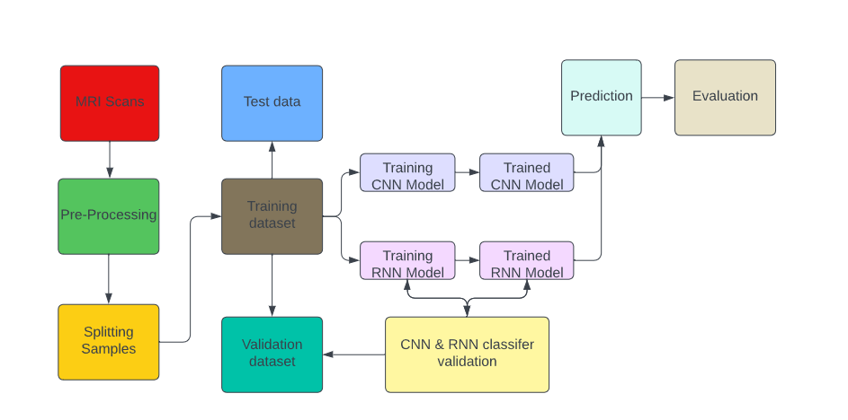
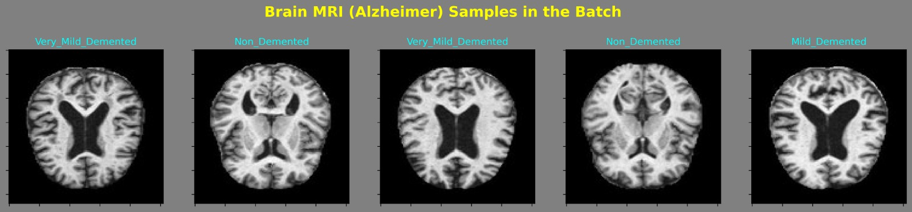
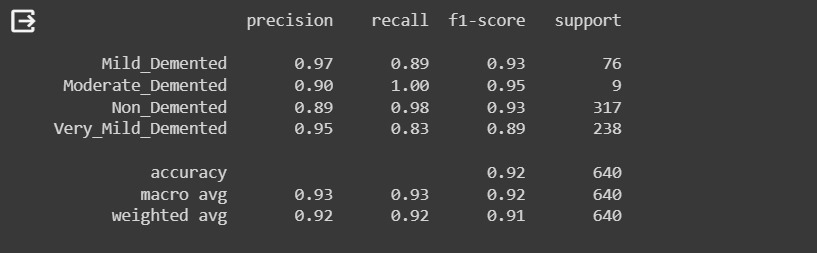
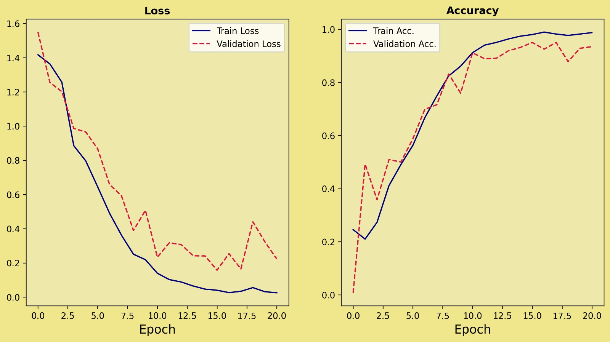
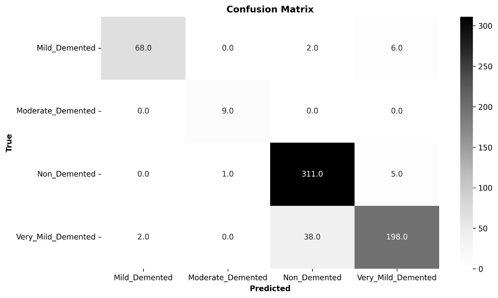
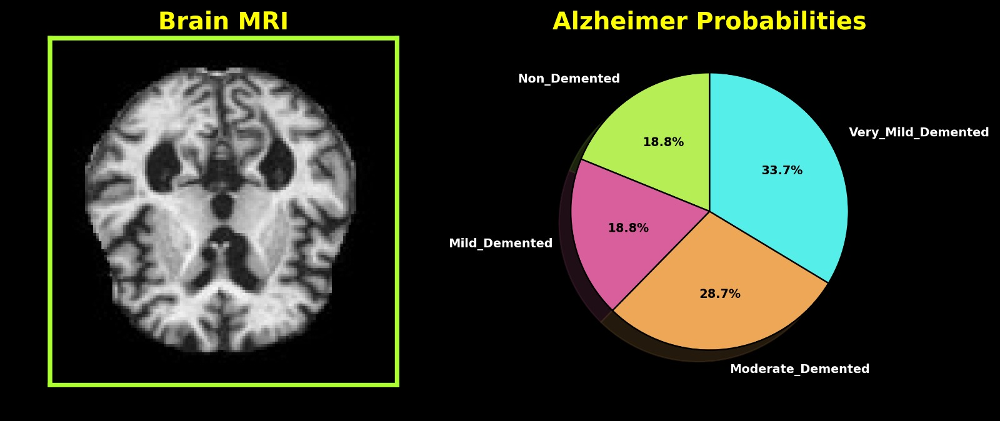
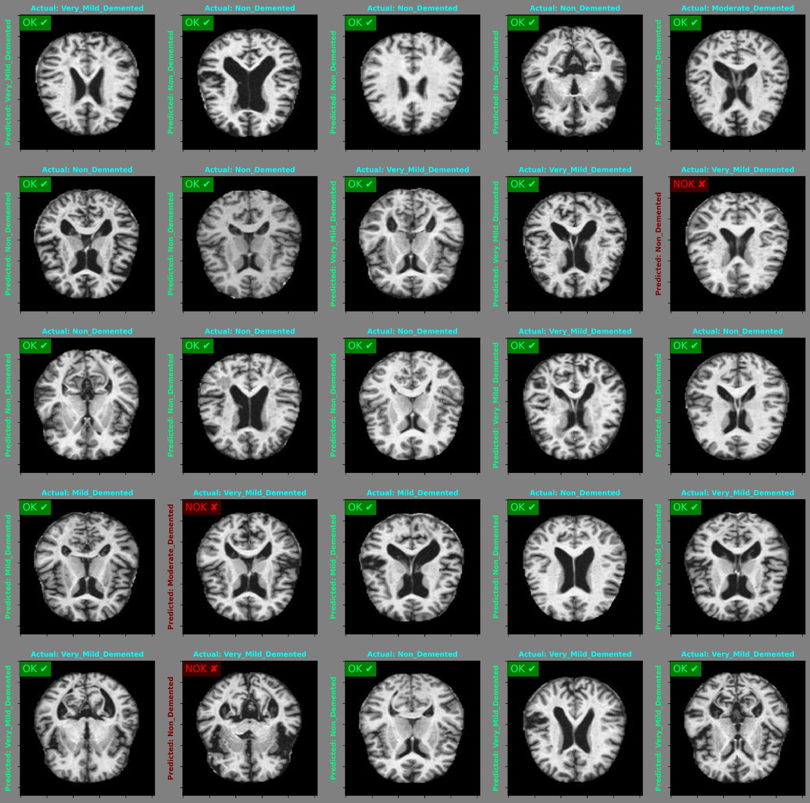

# ALZHIMER-S-DISEASE-DETECTION-USING-DEEP-LEARNING

Alzheimer's disease is a progressive neurological illness that destroys memory, thinking ability, and mental health in general. Proper and timely diagnosis is essential when it comes to effective assistance and recovery. Our objective seeks to develop An approach for predicting Alzheimer's disease using modern technologies in order(CNN & RNN).


## Features

- This research included 6400 identical Magnetic Resonance Images (MRIs), collected from multiple sources.
    - Mild Demented
    - Moderate Demented
    - Non Demented
    - Very Mild Demented
- Performs real-time emotion Magnetic Resonance Images using a pre-trained CNN and RNN model.
- Classifies the Magnetic Resonance Images (MRIs) and provides a Green tick for the Magnetic Resonance Images (MRIs) with Alzheimer's disease.
- To improve model convergence and minimize the effect of pixel value fluctuation, preprocess MRI images with standardization and normalizing procedures.
- Having the imbalanced nature of medical datasets in mind, evaluate model performance using metrics such as accuracy, precision, recall, and F1-score to provide an in-depth understanding of classification performance.  


## Requirements

- Python 
- GPU (check availability and utilizes it if present)
- Environment with the specified Python libraries (Jupyter Notebooks, Google Colab)
- Required Python packages: 
pandas, pandas, matplotlib, seaborn, keras, tensorflow, scikit-learn.

## Architecture Diagram/Flow
[]

## Installation

1. Install the required python libraries:


   ```shell
   !pip install pandas numpy matplotlib seaborn tensorflow scikit-learn
2. Install the required packages:

   ```shell
   pip install keras
3. If you face any issues related to GPU support or TensorFlow installation, you might need to install specific versions or configure GPU drivers.

## Usage

1. Navigate to Google Colab and Create a new notebook.
   ```shell
   https://colab.research.google.com/
   ```

2. Upload the dataset of four classes to Google drive (The dataset has the MRIs images of brain).
    ```
    from google.colab import drive
    drive.mount('/content/drive')
    ```

3. After uploading the dataset in the Google Drive, Mount Drive with the Google Colab repository.

4. Execute the Alzheimer's Disease Detection script in the Colab notebook, which may involve adapting the script to run within a notebook environment.

5. Make sure that the Alzheimer's Disease Prediction script runs within the Colab notebook environment and required packages are installed in the Colab environment using the following commands.
    ```
    !pip install package_name
    ```

6. Display the prediction results directly within the Colab notebook.

7. Include visualizations, such as predicted classes or probability scores, to enhance result interpretation.

8. Repeat the process by providing new inputs, changing the optimizer, Ephocs and with different MRIs.

### Mathematical Equations
#### 1. Accuracy:
The accuracy measures the overall correctness of the classification model. It is
the ratio of correctly predicted instances to the total instances.

```
Accuracy = Number of Correct Predictions/Total Number of Predictions
```

#### 2. Precision:
Precision is the ratio of correctly predicted positive observations to the total
predicted positives. It is a measure of how many of the predicted positive
instances are actually positive.
```
Precision = True Positives/True Positives + False Positives
```

#### 3. F1 Score:
The F1 Score is the harmonic mean of precision and recall, providing a balance
between the two metrics.
```
F1 Score = 2×(Precision×Recall/Precision + Recall)
```
4. Confusion Matrix:
The confusion matrix is a table that describes the performance of a classification
model. It contains information about true positive, true negative, false positive,
and false negative predictions.
~~~
[True Negative (TN) False Positive (FP)
False Negative (FN) True Positive (TP)]
~~~
5. Loss Function:
A loss function, in the context of machine learning, quantifies the difference
between the predicted values generated by a model and the actual ground truth,
serving as a measure of the model's performance during training.
~~~
Lcross-entropy(xi) = -(yi log(f(xi))+(1-yi)log(1-f(xi)))
~~~

## Program:
### Import packages
Imports essential libraries for data manipulation, visualization, and deep learning using TensorFlow and Keras, while also configuring some settings for plotting.

```python
import pandas as pd
import numpy as np
import matplotlib.pyplot as plt
import matplotlib.image as mpimg
import seaborn as sns
import math
import os
import warnings
warnings.filterwarnings('ignore')

from sklearn.utils.class_weight import compute_class_weight
from sklearn.metrics import classification_report, confusion_matrix

import keras
from tensorflow import keras
from keras import Sequential
from keras import layers
import tensorflow as tf
from tensorflow.keras.preprocessing import image_dataset_from_directory
from tensorflow.keras import Sequential
from tensorflow.keras.utils import to_categorical
from tensorflow.keras.layers import Dense, Dropout, Activation, BatchNormalization, Flatten, Conv2D, MaxPooling2D
from tensorflow.keras.callbacks import ModelCheckpoint, EarlyStopping

plt.rcParams["figure.figsize"] = (10,6)
plt.rcParams['figure.dpi'] = 300
colors = ["#B6EE56", "#D85F9C", "#EEA756", "#56EEE8"]
```
### Target Value Distribution
```python
try:
    if tf.test.gpu_device_name():
        physical_devices = tf.config.experimental.list_physical_devices('GPU')
        print('GPU active! -', physical_devices)
    else:
        print('GPU not active!')
except Exception as e:
    print('An error occurred while checking the GPU:', e)
```
### Generate TF Dataset
```python
data = tf.keras.utils.image_dataset_from_directory(PATH,
                                                batch_size = 32,
                                                image_size=(128, 128),
                                                shuffle=True,
                                                seed=42,)

class_names = data.class_names
```
### MRI Samples for Each Class
```py
def sample_bringer(path, target, num_samples=5):

    class_path = os.path.join(path, target)

    image_files = [image for image in os.listdir(class_path) if image.endswith('.jpg')]

    fig, ax = plt.subplots(1, num_samples, facecolor="gray")
    fig.suptitle(f'{target} Brain MRI Samples', color="yellow",fontsize=16, fontweight='bold', y=0.75)

    for i in range(num_samples):
        image_path = os.path.join(class_path, image_files[i])
        img = mpimg.imread(image_path)

        ax[i].imshow(img)
        ax[i].axis('off')
        ax[i].set_title(f'Sample {i+1}', color="aqua")

    plt.tight_layout()

for target in class_names:
    sample_bringer(PATH, target=target)
```
```py
alz_dict = {index: img for index, img in enumerate(data.class_names)}

class Process:
    def __init__(self, data):
        self.data = data.map(lambda x, y: (x/255, y))

    def create_new_batch(self):
        self.batch = self.data.as_numpy_iterator().next()
        text = "Min and max pixel values in the batch ->"
        print(text, self.batch[0].min(), "&", self.batch[0].max())

    def show_batch_images(self, number_of_images=5):
        fig, ax = plt.subplots(ncols=number_of_images, figsize=(20,20), facecolor="gray")
        fig.suptitle("Brain MRI (Alzheimer) Samples in the Batch", color="yellow",fontsize=18, fontweight='bold', y=0.6)
        for idx, img in enumerate(self.batch[0][:number_of_images]):
            ax[idx].imshow(img)
            class_no = self.batch[1][idx]
            ax[idx].set_title(alz_dict[class_no], color="aqua")
            ax[idx].set_xticklabels([])
            ax[idx].set_yticklabels([])

    def train_test_val_split(self, train_size, val_size, test_size):

        train = int(len(self.data)*train_size)
        test = int(len(self.data)*test_size)
        val = int(len(self.data)*val_size)

        train_data = self.data.take(train)
        val_data = self.data.skip(train).take(val)
        test_data = self.data.skip(train+val).take(test)

        return train_data, val_data, test_data
```
```py
process = Process(data)
process.create_new_batch()
process.show_batch_images(number_of_images=5)
```
```py
train_data, val_data, test_data= process.train_test_val_split(train_size=0.8, val_size=0.1, test_size=0.1)
```
```py
y_train = tf.concat(list(map(lambda x: x[1], train_data)), axis=0)
class_weight = compute_class_weight('balanced',classes=np.unique(y_train), y=y_train.numpy())
class_weights = dict(zip(np.unique(y_train), class_weight))
```
### Model Building(CNN & RNN)
```py
from keras.models import Sequential
from keras.layers import Conv2D, MaxPooling2D, Flatten, Dense, SimpleRNN, TimeDistributed

def build_model():
    model = Sequential()

    model.add(Conv2D(filters=16, kernel_size=(3, 3), strides=(1, 1), activation="relu", kernel_initializer='he_normal',
                     input_shape=(128, 128, 3)))
    model.add(MaxPooling2D(pool_size=(2, 2)))

    model.add(Conv2D(filters=32, kernel_size=(3, 3), strides=(1, 1), activation="relu", kernel_initializer='he_normal'))
    model.add(MaxPooling2D(pool_size=(2, 2)))

    model.add(Conv2D(filters=128, kernel_size=(3, 3), strides=(1, 1), activation="relu", kernel_initializer='he_normal'))
    model.add(MaxPooling2D(pool_size=(2, 2)))

    # Add TimeDistributed layer to make the output 3D
    model.add(TimeDistributed(Flatten()))

    # Add Simple RNN layer
    model.add(SimpleRNN(units=64, activation='relu'))

    model.add(Dense(128, activation="relu", kernel_initializer='he_normal'))
    model.add(Dense(64, activation="relu"))
    model.add(Dense(4, activation="softmax"))

    model.compile(optimizer='adam', loss="sparse_categorical_crossentropy", metrics=['accuracy'])

    model.summary()

    return model

model = build_model()

```
```py
def checkpoint_callback():

    checkpoint_filepath = '/tmp/checkpoint'

    model_checkpoint_callback= ModelCheckpoint(filepath=checkpoint_filepath,
                           save_weights_only=False,
                           frequency='epoch',
                           monitor='val_accuracy',
                           save_best_only=True,
                           verbose=1)

    return model_checkpoint_callback

def early_stopping(patience):
    es_callback = tf.keras.callbacks.EarlyStopping(monitor='val_loss', patience=patience, verbose=1)
    return es_callback


EPOCHS = 5
checkpoint_callback = checkpoint_callback()
early_stopping = early_stopping(patience=5)
callbacks = [checkpoint_callback, early_stopping]
```
```py
history = model.fit(train_data, epochs = EPOCHS, validation_data = val_data, class_weight = class_weights, callbacks = callbacks)
```
### Loss and Accuracy
```py
# Save the trained model
model.save("your_model_name.h5")

fig, ax = plt.subplots(1, 2, figsize=(12,6), facecolor="khaki")
ax[0].set_facecolor('palegoldenrod')
ax[0].set_title('Loss', fontweight="bold")
ax[0].set_xlabel("Epoch", size=14)
ax[0].plot(history.epoch, history.history["loss"], label="Train Loss", color="navy")
ax[0].plot(history.epoch, history.history["val_loss"], label="Validation Loss", color="crimson", linestyle="dashed")
ax[0].legend()
ax[1].set_facecolor('palegoldenrod')
ax[1].set_title('Accuracy', fontweight="bold")
ax[1].set_xlabel("Epoch", size=14)
ax[1].plot(history.epoch, history.history["accuracy"], label="Train Acc.", color="navy")
ax[1].plot(history.epoch, history.history["val_accuracy"], label="Validation Acc.", color="crimson", linestyle="dashed")
ax[1].legend()
```
### Evaluating Test Data
```py
model.evaluate(test_data)
```
### Classification Report
```py
predictions = []
labels = []

for X, y in test_data.as_numpy_iterator():
    y_pred = model.predict(X, verbose=0)
    y_prediction = np.argmax(y_pred, axis=1)
    predictions.extend(y_prediction)
    labels.extend(y)

predictions = np.array(predictions)
labels = np.array(labels)

print(classification_report(labels, predictions, target_names=class_names))
```
### Confusion Matrix
```py
cm = confusion_matrix(labels, predictions)
cm_df = pd.DataFrame(cm, index=class_names, columns=class_names)
cm_df
plt.figure(figsize=(10,6), dpi=300)
sns.heatmap(cm_df, annot=True, cmap="Greys", fmt=".1f")
plt.title("Confusion Matrix", fontweight="bold")
plt.xlabel("Predicted", fontweight="bold")
plt.ylabel("True", fontweight="bold")
```
### Alzheimer Probability of a Random MRI from Test Data
```py
def random_mri_prob_bringer(image_number=0):

    for images, _ in test_data.skip(5).take(1):
        image = images[image_number]
        pred = model.predict(tf.expand_dims(image, 0))[0]

    probs = list(tf.nn.softmax(pred).numpy())
    probs_dict = dict(zip(class_dist.keys(), probs))

    keys = list(probs_dict.keys())
    values = list(probs_dict.values())

    fig, (ax1, ax2) = plt.subplots(1, 2, facecolor='black')
    plt.subplots_adjust(wspace=0.4)
    ax1.imshow(image)
    ax1.set_title('Brain MRI', color="yellow", fontweight="bold", fontsize=16)

    edges = ['left', 'bottom', 'right', 'top']
    edge_color = "greenyellow"
    edge_width = 3
    for edge in edges:
        ax1.spines[edge].set_linewidth(edge_width)
        ax1.spines[edge].set_edgecolor(edge_color)

    plt.gca().axes.yaxis.set_ticklabels([])
    plt.gca().axes.xaxis.set_ticklabels([])

    wedges, labels, autopct = ax2.pie(values, labels=keys,  autopct='%1.1f%%',
        shadow=True, startangle=90, colors=colors, textprops={'fontsize': 8, "fontweight":"bold", "color":"white"},  wedgeprops=
       {'edgecolor':'black'} , labeldistance=1.15)

    for autotext in autopct:
        autotext.set_color('black')

    ax2.set_title('Alzheimer Probabilities', color="yellow", fontweight="bold", fontsize=16)

rand_img_no = np.random.randint(1, 32)
random_mri_prob_bringer(image_number=rand_img_no)
```
### Comparing Predicted Classes with the Actual Classes from the Test Data
```py
plt.figure(figsize=(20, 20), facecolor="gray")
for images, labels in test_data.take(1):
    for i in range(25):
        ax = plt.subplot(5, 5, i + 1)
        plt.imshow(images[i])
        predictions = model.predict(tf.expand_dims(images[i], 0), verbose=0)
        score = tf.nn.softmax(predictions[0])
        if(class_names[labels[i]]==class_names[np.argmax(score)]):
            plt.title("Actual: "+class_names[labels[i]], color="aqua", fontweight="bold", fontsize=10)
            plt.ylabel("Predicted: "+class_names[np.argmax(score)], color="springgreen", fontweight="bold", fontsize=10)
            ok_text = plt.text(2, 10, "OK \u2714", color="springgreen", fontsize=14)
            ok_text.set_bbox(dict(facecolor='lime', alpha=0.5))

        else:
            plt.title("Actual: "+class_names[labels[i]], color="aqua", fontweight="bold", fontsize=10)
            plt.ylabel("Predicted: "+class_names[np.argmax(score)], color="maroon", fontweight="bold", fontsize=10)
            nok_text = plt.text(2, 10, "NOK \u2718", color="red", fontsize=14)
            nok_text.set_bbox(dict(facecolor='maroon', alpha=0.5))
        plt.gca().axes.yaxis.set_ticklabels([])
        plt.gca().axes.xaxis.set_ticklabels([])
```
## Output:
### Brain MRI Sample in Batch

### Predicted Values

### Loss and Accuracy

### Confussion Matrix

### Alzheimer Probability of a Random MRI from Test Data

### Predicted Output


## Result:

The Alzheimer's Disease Prediction project is a revolutionary project that makes use of Recurrent Neural Networks (RNN) and Convolutional Neural Networks (CNN) to help diagnose Alzheimer's disease earlier. Using technologically advanced machine learning techniques, this continuous system analyses brain imaging data to discover complex patterns that may indicate changes associated with Alzheimer's disease.

Healthcare practitioners may detect the risks before they occur because they can utilize the project's precise and accurate forecasting based on input data, which are produced by utilizing CNN and RNN architectures. Combining these deep learning models enables a thorough examination of the neuro data's series and structural patterns, improving the accuracy of Alzheimer's disease prediction.

For medical professionals, researchers, and technologists who work in neurology and medical diagnostics, this initiative is a significant resource. The combination of CNN and RNN not only highlights the potential advantages of deep learning in the fields of medicine but could potentially have a substantial influence on the early detection and treatment of Alzheimer's disease, thus strengthening the field of healthcare technology.


